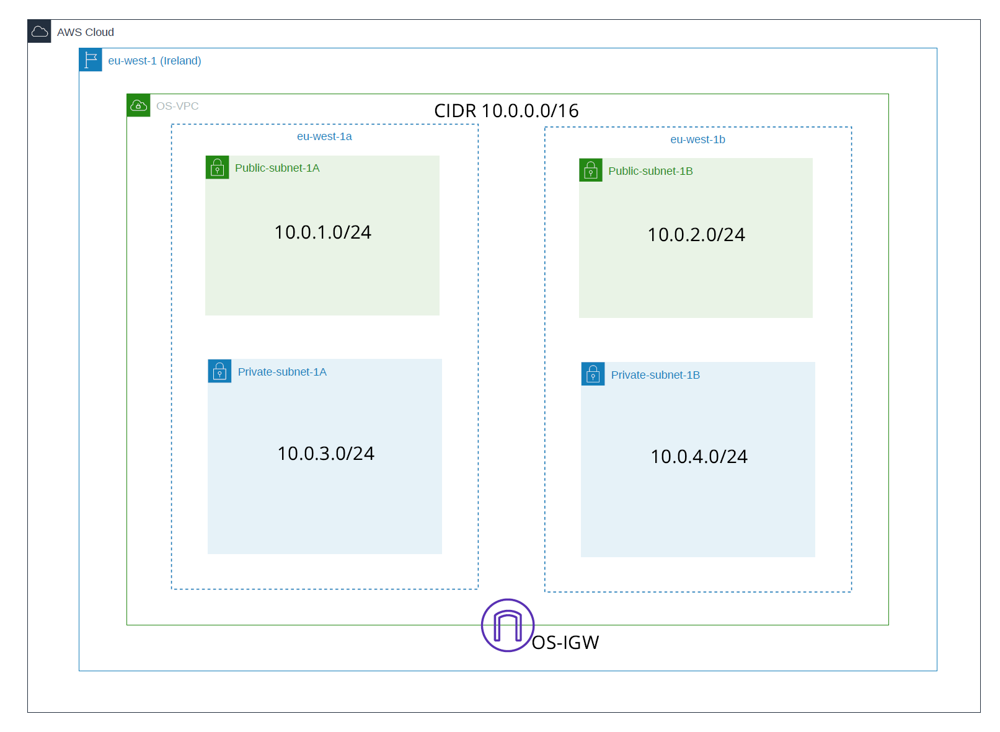

# Creation of a VPC in AWS Cloud

----

# Create VPC

Name: OS-VPC  
IPv4 CIDR Block: 10.0.0.0/16  

# Availability Zones

eu-west-1a  
eu-west-1b  

### Subnets
Name: Public-subnet-1A  
Availability Zone: eu-west-1a  
IPv4 CIDR Block: 10.0.1.0/24   

Name: Private-subnet-1A  
Availability Zone: eu-west-1a  
IPv4 CIDR Block: 10.0.3.0/24  

Name: Public-subnet-1B  
Availability Zone: eu-west-1b  
IPv4 CIDR Block: 10.0.2.0/24  

Name: Private-subnet-1B  
Availability Zone: eu-west-1b  
IPv4 CIDR Block: 10.0.4.0/24  

### Private route table

Name: Private-RT  
VPC: OS-VPC  
Subnet associations: Private-subnet-1A, Private-subnet-1B  

### Internet Gateway

Name: OS-IGW  
VPC: OS-VPC  

### NAT Gateway

Name: MyNatGW  
Subnet: Public-subnet-1A  

### Architectural Diagram

  

  
